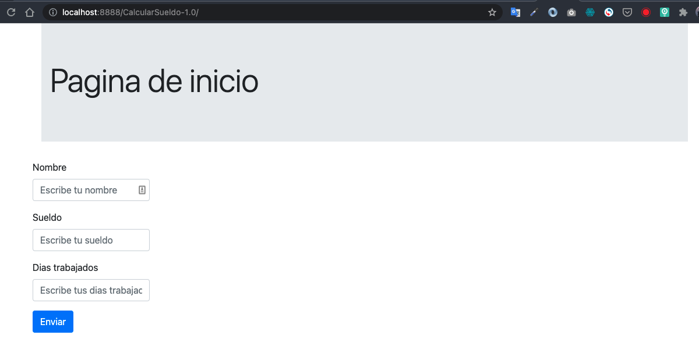

# UAEMex Diplomado Backend module

## Requirements
* Docker
* Docker Compose

## Start project
Run this comands into root folder
```
docker-compose up server
```

Tomcat server will available in `localhost:8888`
You Could check my projects in its url domain, for example, if you want to check CalcularSaldo project, it is available over `http://localhost:8888/CalcularSueldo-1.0/`

### Calcular Sueldo


### Ecuacion cuadratica

